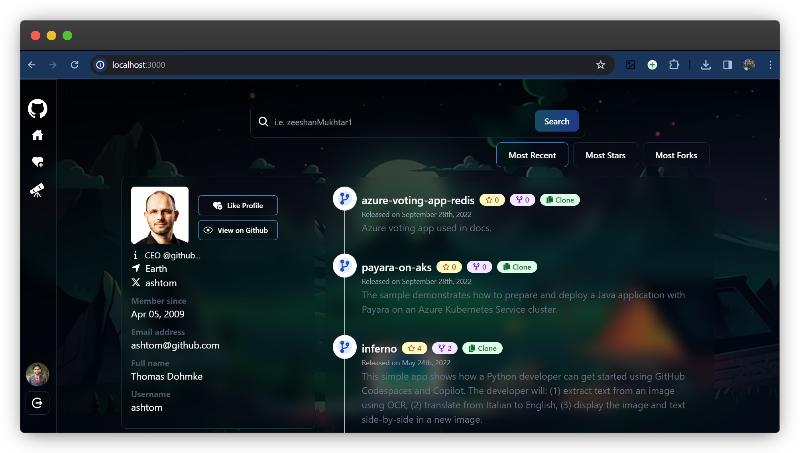

# GitHub Lite 🌐

GitHub Lite is a simplified web application that allows users to explore GitHub profiles, discover repositories, and interact with basic user data. It provides a minimalistic interface to quickly access GitHub information without the clutter. Explore GitHub profiles. Like your favorite profiles. View your liked profiles. Simple and easy to use.

## Technologies Used 🛠

### Frontend 🌈

- React
- React Router
- React Icons
- React Hot Toast
- Vite (Build tool for React)
- Tailwind CSS (Styling)
- SCSS (Styling)

### Backend 💻

- Express.js
- OAuth (GitHub Authentication)
- MongoDB (Database)
- Mongoose (Object Modeling for MongoDB)

## Features 🚀

- **User Profile Exploration:**
  Explore GitHub profiles by entering a GitHub username.

- **Repository Viewing:**
  View repositories associated with a GitHub user.

- **Profile Like:**
  Like GitHub profiles to keep track of your favorite users.

- **Like History:**
  View a list of profiles you've liked.

- **Repository Sorting:**
  Sort repositories based on criteria like Most Recent, Most Stars, Most Forks, etc.

- **Explore Page:**
  Discover popular repositories from multiple users.

  ## Screenshots 📸




## Getting Started 👋

1. Clone the repository:

   ```bash
   git clone https://github.com/ZeeshanMukhtar1/GitHub-Lite.git
   ```

2. Install dependencies:

   ```bash
   cd client
   npm install
   cd server
   npm install
   ```

3. Set up environment variables:
   Create a `.env` file in the `server` directory, the sample file is provided as `.env.sample` in the `server` directory for reference.

4. Run the application:
   ```bash
   npm run dev
   ```

## Usage 📝

1. Access the application at `http://localhost:3000` in your browser.

2. Explore GitHub profiles and repositories.

3. Like profiles to create a list of favorite users.

## Authentication 🔏

To access the Explore Page and Like History features, authentication via GitHub is required. Please log in to GitHub to access these features.

## Contributing 🤝

Contributions are welcome! If you find any issues or have suggestions for improvements, please [raise an issue](https://github.com/ZeeshanMukhtar1/GitHub-Lite/issues) or submit a [pull request](https://github.com/ZeeshanMukhtar1/GitHub-Lite/pulls). We welcome all contributions that help us improve the application. Please follow the [Contribution Guidelines](CONTRIBUTING.md) before making a contribution.

## Open Source License 📜

GitHub Lite is an open-source project. Feel free to contribute, fork, or use the code as per the terms of the [MIT License](LICENSE). Your contributions are valuable and appreciated.

## Contributors 🌟

<a href="https://github.com/zeeshanMukhtar1/gitHub-Lite/graphs/contributors">
  
</a>
